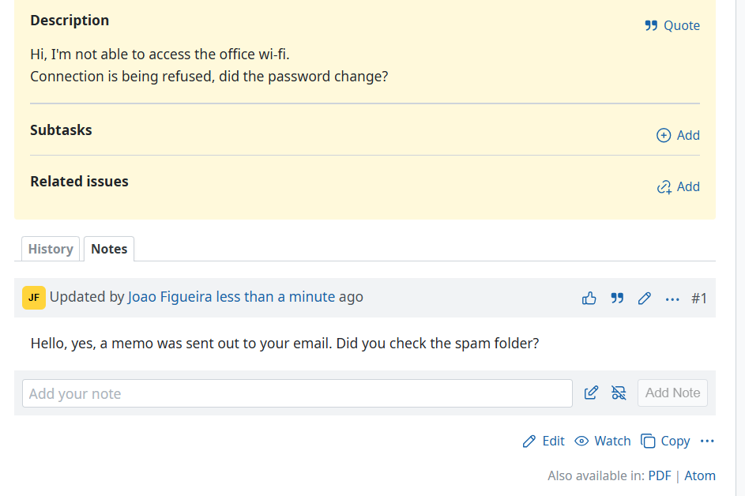
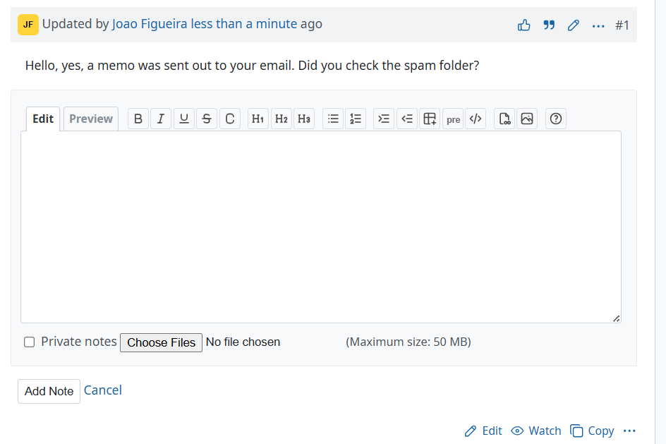

# Redmine Easy Notes

Adds a one-line "Add note" box under the issue history, so leaving a comment does
not mean opening the whole issue edit form.



Redmine has no way to add a note without revealing the full editor, which also
exposes the subject, description and every other attribute. That makes it easy to
change the issue by accident on the way to commenting. See
[feature #3143](https://www.redmine.org/issues/3143), open since 2009 and still
not in core.

## What you get

A bar styled like a journal entry appears below the notes. It contains:

* a one-line text field, placeholder "Add your note"
* an "Open full editor" icon that swaps the bar for the full editor (jstoolbar,
  preview, `@`-mention autocomplete, private notes, attachments), keeping
  whatever was typed
* a public/private toggle: a `spy-off` icon labelled "Public Note" that flips to
  `spy` labelled "Private Note", coloured like a checked checkbox
* an "Add Note" button, disabled until the field has something in it

One click on the icon, or Shift+Enter, swaps the bar for the full editor:



## Keys and behaviour

| Action | Result |
|---|---|
| Enter | Submits the note |
| Shift+Enter | Opens the full editor, keeping the text and adding the line break |
| Cancel in the full editor | Discards the note and returns to the one-liner, both boxes empty |
| Drop a file on the one-liner | Opens the full editor, attaches the file and inserts the inline image markup, exactly as core does |
| Quote on an existing note | Lands in this editor instead of reopening the issue edit form |

Quoting keeps whatever was already being written and appends the quote after it.
Quoting a private note keeps the reply private. If the issue edit form is already
open when you click Quote, quoting is left alone: you are editing the issue, so
the quote stays where you are looking.

The toggle and the full editor's "Private notes" checkbox are two views of one
value and stay in sync both ways, so the bar cannot claim a note is public while
the checkbox disagrees. Cancel does not reset it: the toggle is visible on the
bar, and quietly flipping a note back to public is the one mistake here with a
real consequence.

There is one note being composed at a time, and one of the two editors is
showing it. Switching hands the text over instead of leaving a copy behind, so
the two boxes cannot drift apart and show different things.

## Switching it on per project

It is a project module, so it is off until someone turns it on. Go to
**Project settings, Modules**, tick **Easy notes**, save.

Where the module is off, the issue page is exactly the stock page: no bar, no
stylesheet, no script, and core's own Quote behaviour. Nothing about the page
changes.

Two consequences worth knowing:

* After installing, no project has it on, including existing ones. Tick the
  projects you want.
* New projects get it only if you add it to
  **Administration, Settings, Projects, Default enabled modules**.

To turn it on everywhere at once:

```ruby
# RAILS_ENV=production bin/rails runner
Project.find_each { |p| p.enabled_module_names |= ['easy_notes'] }
```

## Permissions

The bar renders only when `@issue.notes_addable?`, which is the "Add notes"
(`add_issue_notes`) permission. The private toggle and checkbox appear only with
`set_notes_private`. The attachment field appears only when
`attachments_addable?`.

Registering a project module requires naming at least one permission, so there
is a marker permission, `view_easy_notes`. It is declared public, which keeps it
out of the role form entirely, so no role gains or loses anything and there is
nothing to re-tick after installing. Nothing is ever checked against it; the
real gates are the module and the core permissions above.

## Requirements

Redmine 7.0.0 or later. The markup mirrors Redmine 7's journal header
(`sprite_icon`, flex `.journal-header`, `textarea_tag`), so earlier versions are
untested. No gems, no migrations, no controllers, no routes.

## Install

```bash
cd {REDMINE_ROOT}/plugins
git clone https://github.com/joaoperfig/redmine_easy_notes.git
cd ..
RAILS_ENV=production bin/rails assets:precompile
```

Then restart Redmine. The restart is not optional. Propshaft resolves
`.manifest.json` once at boot, so a running server keeps serving the old asset
digests and the plugin looks like it did nothing.

## Theming

The private toggle's colour is read at runtime from the computed `accent-color`
of the real "Private notes" checkbox, so a theme that sets `accent-color` on
checkboxes is matched without configuration. Where that resolves to `auto`, the
CSS system colour `AccentColor` is used. To force a colour, set the property:

```css
#easy-notes { --easy-notes-private-color: #e90062; }
```

The "Add Note" button is an `<input type="submit">` rather than a
`<button type="submit">` on purpose. Themes reliably style `input[type=submit]`
and frequently miss the `button` form, so a `button` silently loses the theme's
colours and hover.

## Licence

GPL-2.0-or-later, matching Redmine.

The `spy` and `spy-off` icons in `assets/images/icons.svg` come from
[Tabler Icons](https://tabler.io/icons) (MIT, (c) 2020-2024 Pawel Kuna), the same
set Redmine core draws its own sprite from, so they match visually.
